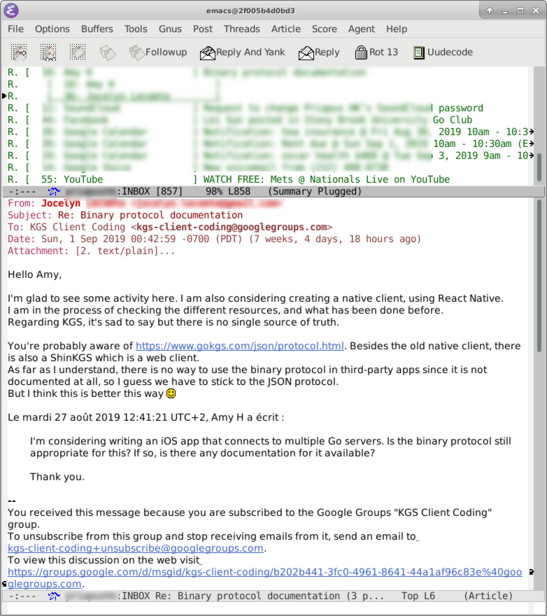

# See Your Gmail in a Docker Container
Begin by turning on "Less secure app access" from Gmail's settings.

Clone this repo, and `make run`.  To avoid a potential "mail-strom", the container configuration limits the initial download to 1000 messages and filters out attachments exceeding 100kB.

# Now Do It Without Docker
Make a quick study of [build.sh](https://github.com/dickmao/gnus-imap-walkthrough/blob/master/build.sh).  The prescribed setup is neither secure (!) nor feature complete, but should serve as a solid baseline.  I can offer some guarantees against bitrot as I periodically [run the build](https://circleci.com/gh/dickmao/gnus-imap-walkthrough) on a CircleCI Ubuntu image.

# Why I Use Gnus
> Its [sic] 2019, the only thing you should be using is notmuch.
>
> &mdash; <cite>Uncited redditor</cite>

> I use Gnus, and am currently subscribed to 95 mailing lists. It really makes almost any number of lists manageable, because I can temporarily unsubscribe, set "levels" to view only certain lists at a time, organize them into "topics", apply automatic filtering and adaptive scoring to drop messages it knows I don't care about, etc., etc. It's a pretty huge investment, learning-wise, but it's the most capable tool for the job that I know of.
>
> &mdash; <cite>John Wiegley, Emacs Maintainer</cite>

Can you track all your Usenet, [Reddit](https://github.com/dickmao/nnreddit), RSS, and mailing list activity from a single dashboard?  If so, please let me know in an [Issue](https://github.com/dickmao/gnus-imap-walkthrough/issues)!  I also tire of Gnus's peculiarities although at this point I may be too far invested.
